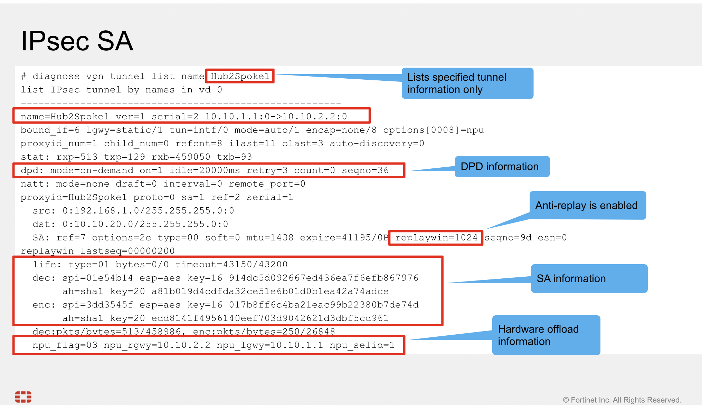
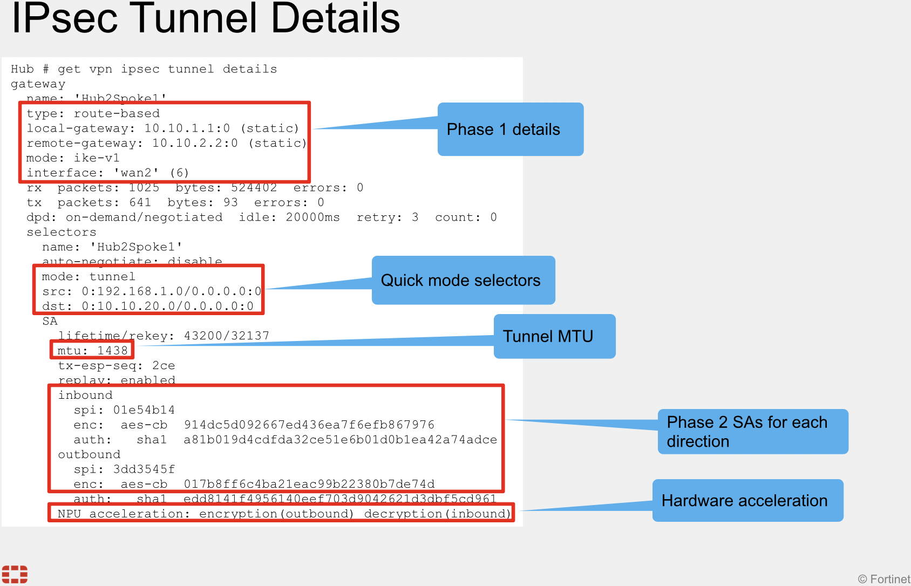
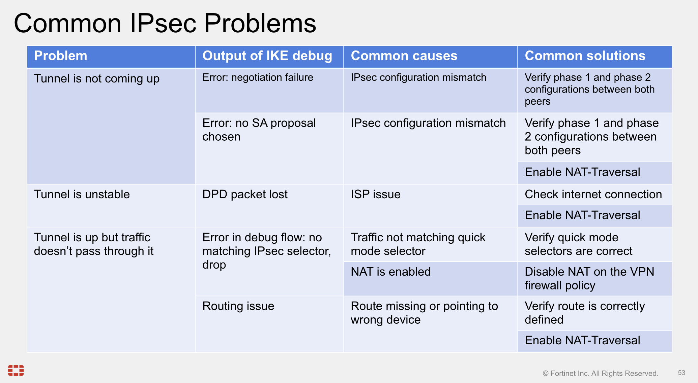

# Fortigate IPSEC debug

!!! tip
    DO YOU HAVE A POLICY ALLOWING VPN TO GO UP ?

## Security

### DH Groups

## Diagnose commands

### Check SA

`diagnose vpn tunnel list name VpnName`

### Tunnel details

`get vpn ipsec tunnel details`

### Common issues

